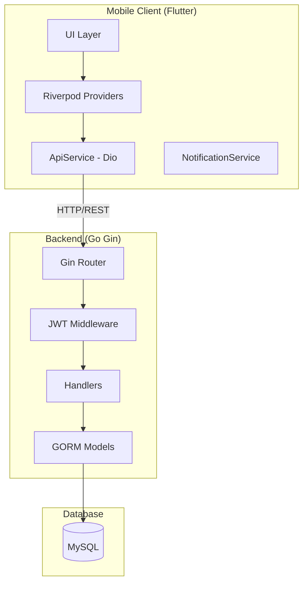

# Design Document

## Overview

Daily Planner App 是一个全栈移动应用，采用前后端分离架构。后端使用 Go (Gin) 框架提供 RESTful API，MySQL 作为数据存储，JWT 实现无状态认证。前端使用 Flutter 构建跨平台移动应用，Riverpod 管理状态，Dio 处理网络请求。

## Architecture

### 系统架构图



### 后端目录结构

```
backend/
├── cmd/
│   └── main.go                 # 应用入口
├── internal/
│   ├── config/
│   │   └── config.go           # 配置管理
│   ├── models/
│   │   ├── user.go             # User 模型
│   │   ├── plan.go             # Plan 模型
│   │   ├── expense.go          # Expense 模型
│   │   └── reminder.go         # Reminder 模型
│   ├── handlers/
│   │   ├── auth.go             # 认证处理
│   │   ├── plan.go             # 计划 CRUD
│   │   ├── expense.go          # 消费 CRUD
│   │   └── reminder.go         # 提醒 CRUD
│   ├── middleware/
│   │   └── jwt.go              # JWT 中间件
│   └── database/
│       └── database.go         # 数据库连接与迁移
└── go.mod
```

### Flutter 目录结构

```
flutter_app/
├── lib/
│   ├── main.dart               # 应用入口
│   ├── config/
│   │   └── theme.dart          # 主题配置
│   ├── models/
│   │   ├── user.dart
│   │   ├── plan.dart
│   │   ├── expense.dart
│   │   └── reminder.dart
│   ├── services/
│   │   ├── api_service.dart    # Dio 封装
│   │   └── notification_service.dart
│   ├── providers/
│   │   ├── auth_provider.dart
│   │   ├── plan_provider.dart
│   │   ├── expense_provider.dart
│   │   └── reminder_provider.dart
│   └── screens/
│       ├── login_screen.dart
│       ├── plan_screen.dart
│       ├── expense_screen.dart
│       └── settings_screen.dart
├── pubspec.yaml
└── .github/
    └── workflows/
        └── ios-release.yml
```

## Components and Interfaces

### 后端 API 接口

#### 认证接口

| Method | Endpoint | Description | Auth Required |
|--------|----------|-------------|---------------|
| POST | /api/auth/register | 用户注册 | No |
| POST | /api/auth/login | 用户登录 | No |

#### 计划接口

| Method | Endpoint | Description | Auth Required |
|--------|----------|-------------|---------------|
| GET | /api/plans | 获取计划列表 | Yes |
| POST | /api/plans | 创建计划 | Yes |
| PUT | /api/plans/:id | 更新计划 | Yes |
| DELETE | /api/plans/:id | 删除计划 | Yes |

#### 消费接口

| Method | Endpoint | Description | Auth Required |
|--------|----------|-------------|---------------|
| GET | /api/expenses | 获取消费列表 | Yes |
| POST | /api/expenses | 创建消费记录 | Yes |
| PUT | /api/expenses/:id | 更新消费记录 | Yes |
| DELETE | /api/expenses/:id | 删除消费记录 | Yes |

#### 提醒接口

| Method | Endpoint | Description | Auth Required |
|--------|----------|-------------|---------------|
| GET | /api/reminders | 获取提醒设置 | Yes |
| POST | /api/reminders | 创建提醒 | Yes |
| PUT | /api/reminders/:id | 更新提醒 | Yes |
| DELETE | /api/reminders/:id | 删除提醒 | Yes |

### Flutter 核心组件

#### ApiService

```dart
class ApiService {
  static final ApiService _instance = ApiService._internal();
  factory ApiService() => _instance;
  
  late Dio _dio;
  
  // 拦截器自动添加 JWT Token
  // 401 响应自动跳转登录页
}
```

#### NotificationService

```dart
class NotificationService {
  // 初始化 flutter_local_notifications
  Future<void> initialize();
  
  // 设置每日定时提醒（早睡）
  Future<void> scheduleDailyNotification(Time time, String title, String body);
  
  // 设置周期性提醒（喝水等）
  Future<void> schedulePeriodicNotification(Duration interval, String title, String body);
  
  // 取消提醒
  Future<void> cancelNotification(int id);
}
```

## Data Models

### 后端 GORM 模型

#### User

```go
type User struct {
    ID          uint      `gorm:"primaryKey"`
    PhoneNumber string    `gorm:"uniqueIndex;not null"`
    Password    string    `gorm:"not null"` // bcrypt hashed
    CreatedAt   time.Time
    UpdatedAt   time.Time
}
```

#### Plan

```go
type Plan struct {
    ID            uint      `gorm:"primaryKey"`
    UserID        uint      `gorm:"index;not null"`
    Content       string    `gorm:"not null"`
    ExecutionDate time.Time `gorm:"index;not null"`
    Status        string    `gorm:"default:'pending'"` // pending, completed
    CreatedAt     time.Time
    UpdatedAt     time.Time
}
```

#### Expense

```go
type Expense struct {
    ID        uint      `gorm:"primaryKey"`
    UserID    uint      `gorm:"index;not null"`
    Amount    float64   `gorm:"not null"`
    Category  string    `gorm:"not null"`
    Note      string
    CreatedAt time.Time
    UpdatedAt time.Time
}
```

#### Reminder

```go
type Reminder struct {
    ID            uint      `gorm:"primaryKey"`
    UserID        uint      `gorm:"index;not null"`
    ReminderType  string    `gorm:"not null"` // bedtime, periodic
    ScheduledTime string    `gorm:"not null"` // HH:MM format or interval
    Content       string    // 提醒内容
    IsEnabled     bool      `gorm:"default:true"`
    CreatedAt     time.Time
    UpdatedAt     time.Time
}
```

### Flutter 数据模型

#### User

```dart
class User {
  final int id;
  final String phoneNumber;
  final String? token;
}
```

#### Plan

```dart
class Plan {
  final int? id;
  final String content;
  final DateTime executionDate;
  final String status; // pending, completed
}
```

#### Expense

```dart
class Expense {
  final int? id;
  final double amount;
  final String category;
  final String? note;
  final DateTime createdAt;
}
```

#### Reminder

```dart
class Reminder {
  final int? id;
  final String reminderType; // bedtime, periodic
  final String scheduledTime;
  final String? content;
  final bool isEnabled;
}
```


## Correctness Properties

*A property is a characteristic or behavior that should hold true across all valid executions of a system-essentially, a formal statement about what the system should do. Properties serve as the bridge between human-readable specifications and machine-verifiable correctness guarantees.*

### Property 1: Password hashing integrity
*For any* user registration with a plaintext password, the stored password in the database SHALL NOT equal the original plaintext and SHALL be verifiable using bcrypt.Compare.
**Validates: Requirements 1.1**

### Property 2: JWT token contains correct UserID
*For any* successful login, the generated JWT token SHALL contain the correct UserID that can be extracted and verified.
**Validates: Requirements 1.2, 1.4**

### Property 3: Invalid credentials rejection
*For any* login attempt with incorrect password or non-existent phone number, the Backend_Service SHALL return a 401 status code.
**Validates: Requirements 1.3**

### Property 4: Invalid JWT rejection
*For any* request with an invalid, malformed, or expired JWT token, the Backend_Service SHALL return a 401 status code.
**Validates: Requirements 1.5**

### Property 5: Plan data isolation
*For any* user querying plans, the returned plans SHALL only contain records where user_id matches the authenticated user's ID.
**Validates: Requirements 3.2**

### Property 6: Plan ownership verification on mutation
*For any* plan update or delete operation, the Backend_Service SHALL verify the plan's user_id matches the authenticated user's ID before allowing the operation.
**Validates: Requirements 3.4, 3.5, 3.6**

### Property 7: Expense data isolation
*For any* user querying expenses, the returned expenses SHALL only contain records where user_id matches the authenticated user's ID.
**Validates: Requirements 4.2**

### Property 8: Expense ownership verification on mutation
*For any* expense update or delete operation, the Backend_Service SHALL verify the expense's user_id matches the authenticated user's ID before allowing the operation.
**Validates: Requirements 4.4, 4.5**

### Property 9: ApiService singleton consistency
*For any* number of ApiService instantiations, all instances SHALL reference the same underlying Dio client and configuration.
**Validates: Requirements 5.5**

### Property 10: JWT token auto-attachment
*For any* authenticated API request made through ApiService, the Authorization header SHALL contain "Bearer {token}" where token is the stored JWT.
**Validates: Requirements 5.3**

## Error Handling

### 后端错误处理

| Error Type | HTTP Status | Response Format |
|------------|-------------|-----------------|
| 认证失败 | 401 | `{"error": "invalid credentials"}` |
| Token 无效 | 401 | `{"error": "invalid or expired token"}` |
| 权限不足 | 403 | `{"error": "access denied"}` |
| 资源不存在 | 404 | `{"error": "resource not found"}` |
| 参数错误 | 400 | `{"error": "validation error", "details": [...]}` |
| 服务器错误 | 500 | `{"error": "internal server error"}` |

### Flutter 错误处理

```dart
// Dio 拦截器处理
onError: (error, handler) {
  if (error.response?.statusCode == 401) {
    // 清除本地 token
    // 导航到登录页
  }
  return handler.next(error);
}
```

## Testing Strategy

### 测试框架选择

- **后端**: Go 标准 testing 包 + [rapid](https://github.com/flyingmutant/rapid) 用于属性测试
- **Flutter**: flutter_test + [glados](https://pub.dev/packages/glados) 用于属性测试

### 单元测试

#### 后端单元测试
- 密码哈希和验证函数
- JWT 生成和解析函数
- 数据库 CRUD 操作
- 中间件逻辑

#### Flutter 单元测试
- 数据模型序列化/反序列化
- Provider 状态管理逻辑
- ApiService 拦截器行为

### 属性测试

每个属性测试必须：
1. 使用注释标注对应的正确性属性：`// **Feature: daily-planner-app, Property {number}: {property_text}**`
2. 配置至少 100 次迭代
3. 使用智能生成器约束输入空间

#### 后端属性测试示例

```go
// **Feature: daily-planner-app, Property 1: Password hashing integrity**
func TestPasswordHashingProperty(t *testing.T) {
    rapid.Check(t, func(t *rapid.T) {
        password := rapid.String().Draw(t, "password")
        hashed, _ := bcrypt.GenerateFromPassword([]byte(password), bcrypt.DefaultCost)
        
        // 哈希值不等于原文
        assert.NotEqual(t, password, string(hashed))
        // 可以验证
        assert.NoError(t, bcrypt.CompareHashAndPassword(hashed, []byte(password)))
    })
}
```

#### Flutter 属性测试示例

```dart
// **Feature: daily-planner-app, Property 9: ApiService singleton consistency**
void main() {
  Glados<int>().test('ApiService singleton returns same instance', (count) {
    final instances = List.generate(count.abs() % 100 + 1, (_) => ApiService());
    for (var i = 1; i < instances.length; i++) {
      expect(identical(instances[0], instances[i]), isTrue);
    }
  });
}
```

### 集成测试

- API 端到端测试（使用测试数据库）
- Flutter Widget 测试
- 认证流程完整测试

